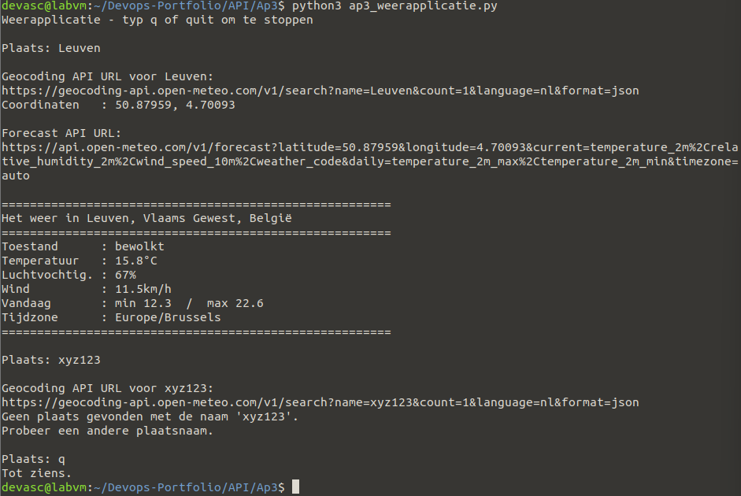

# Ap3 – Eigen API-experiment (Python)

**In één zin:** een Python-applicatie die twee REST-API's aan elkaar knoopt — eerst een plaatsnaam omzetten naar coördinaten, dan die coördinaten gebruiken om het weer op te halen.

## Waarom dit experiment

Lab 4.9.2 bouwt een applicatie rond GraphHopper met een vast patroon: de gebruiker typt een locatie, een geocoding-call maakt daar coördinaten van, en die coördinaten gaan naar een tweede API die het echte antwoord geeft. Ik wilde weten of ik datzelfde patroon zelf kon opzetten met andere API's.

Ik koos Open-Meteo omdat het dezelfde structuur heeft — een aparte geocoding-API en een aparte data-API — maar **geen API-sleutel** nodig heeft. Zo valt één afhankelijkheid weg en werkt het script bij iedereen meteen.

## Uitvoeren

```bash
python3 ap3_weerapplicatie.py
```

Typ een plaats, bijvoorbeeld `Leuven`. Stoppen doe je met `q` of `quit`.




## Wat het script doet

### 1. `geocoding(location)`

```python
requests.get(GEOCODE_URL, params={"name": location, "count": 1,
                                  "language": "nl", "format": "json"})
```

Geeft een tuple terug: `(status, lat, lon, volledige_naam)` — precies zoals de geocoding-functie in het lab een tuple met status, lat en lng teruggeeft.

Net als in het lab blijft de functie vragen zolang er niets ingevuld is:

```python
while location == "":
    location = input("Geef opnieuw een plaats: ")
```

### 2. `weer(lat, lon)`

De coördinaten uit stap 1 gaan naar de tweede API, samen met de gegevens die ik wil zien: temperatuur, luchtvochtigheid, windsnelheid en een weercode.

### 3. De lus met quit-optie

```python
while True:
    plaats = input("Plaats: ")
    if plaats in ("q", "quit"):
        break
```

Zelfde opzet als stap 12 van het lab.

## De valkuil die ik tegenkwam

Bij een onbestaande plaatsnaam geeft Open-Meteo **status 200** terug — de aanvraag is technisch gelukt — maar de sleutel `results` ontbreekt dan volledig in het antwoord. Alleen op de statuscode controleren is dus niet genoeg:

```python
if status == 200 and data.get("results"):
```

Dat is precies dezelfde valkuil als stap 14 in het lab, waar `hits` een lege lijst is bij een onbekende locatie en de test uitgebreid moet worden met `len(json_data["hits"]) != 0`.

Ik gebruik `data.get("results")` en niet `data["results"]`, want bij een ontbrekende sleutel geeft `.get()` gewoon `None` terug in plaats van een `KeyError` te gooien.

## Foutafhandeling

| Situatie | Wat er gebeurt |
|---|---|
| leeg invoerveld | de functie vraagt opnieuw |
| onbestaande plaats | melding, en je mag opnieuw proberen |
| geen internet | `ConnectionError` opgevangen, leesbare melding |
| server antwoordt niet | `Timeout` na 10 seconden |
| Ctrl+C | nette afsluiting in plaats van een stacktrace |

## Verschil met lab 4.9.2

| | Lab 4.9.2 | Dit experiment |
|---|---|---|
| Geocoding | GraphHopper | Open-Meteo |
| Tweede call | routeberekening | weersvoorspelling |
| API-sleutel | verplicht | niet nodig |
| Lege resultaten | `hits` is een lege lijst | `results` ontbreekt helemaal |
| Extra invoer | vervoermiddel (car, bike, foot) | — |

## Mogelijke vragen

**Waarom twee API-calls?**
De weer-API kent geen plaatsnamen, alleen coördinaten. De geocoding-API vertaalt daartussen. Hetzelfde probleem als in het lab: GraphHopper berekent routes tussen punten, niet tussen namen.

**Waarom `params=` en niet de URL zelf samenstellen?**
`requests` codeert dan zelf de speciale tekens. Het lab doet dat met `urllib.parse.urlencode`. Bij zelf plakken met f-strings gaat het mis zodra een plaatsnaam een spatie of een accent bevat.

**Wat betekent status 200 met een leeg resultaat?**
Dat de server je vraag goed begrepen heeft en netjes antwoordt — maar dat het antwoord "niets gevonden" is. Een fout in je zoekterm is geen fout in het protocol.

**Waarom een timeout?**
Zonder timeout blijft het script oneindig hangen als de server niet antwoordt.

**Wat is die weather_code?**
Een cijfercode voor de weerstoestand. Ik zet die met een dictionary om naar leesbare tekst, want `3` zegt de gebruiker niets en "bewolkt" wel.

## Wat ik ondervond

Het interessantste aan dit experiment was dat ik zelf moest uitzoeken hoe je twee API's aan elkaar koppelt — de output van de geocoding-call wordt letterlijk de input van de forecast-call. Ik ben eerst vergeten om de foutafhandeling toe te voegen, waardoor een verkeerde plaatsnaam het script deed crashen met een onduidelijke `KeyError`; door dat expliciet op te vangen met een `ValueError` en een duidelijke boodschap werd het script veel gebruiksvriendelijker.
```

---
