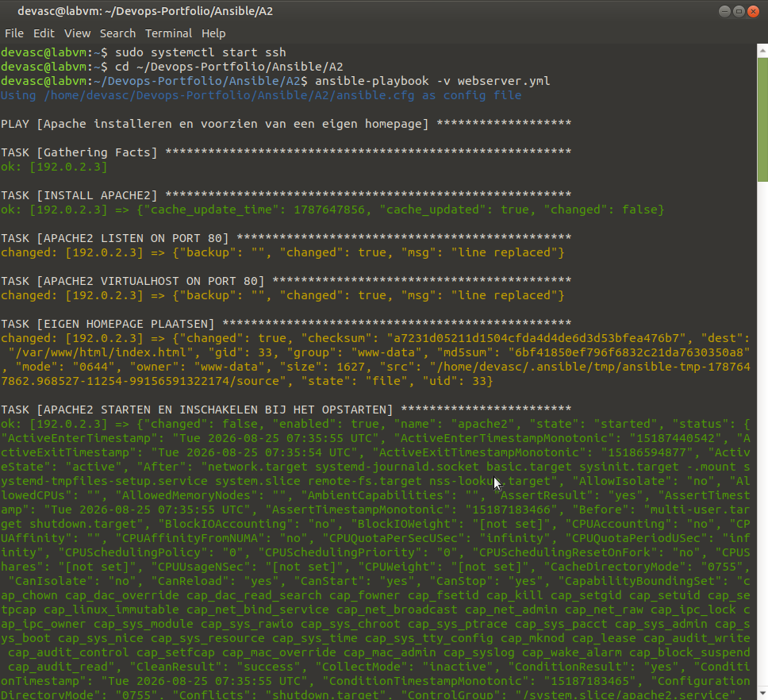
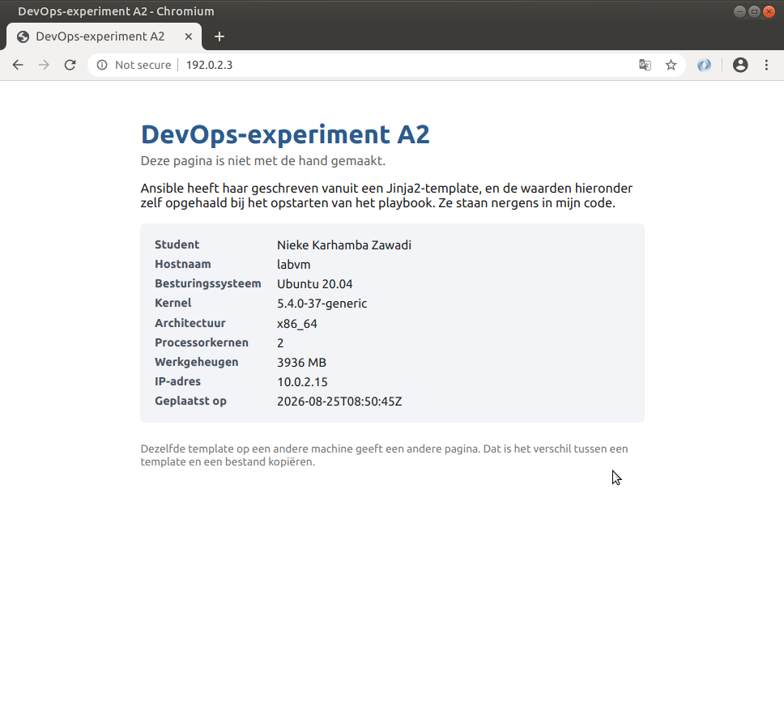
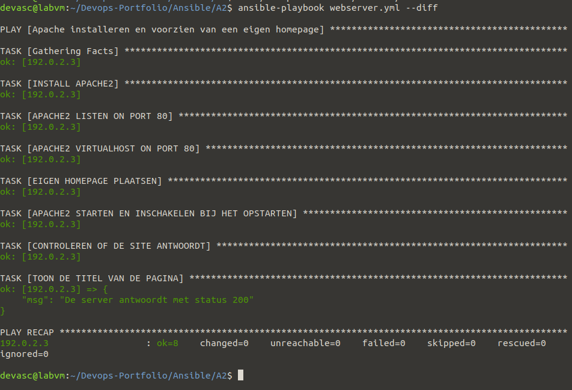

# A2 – Eigen playbook-experiment: webserver met een specifieke home page

**In één zin:** een playbook dat Apache installeert, de poort op 80 zet, en er een homepage op plaatst die uit een Jinja2-template komt en gevuld wordt met gegevens van de machine zelf.

## Waarom dit experiment

Lab 7.4.8 installeert Apache en verzet met `lineinfile` de poort naar 8081. Wat het lab **niet** doet, is een eigen pagina plaatsen. Ik wilde het verschil zien tussen een bestaand bestand aanpassen en een nieuw bestand genereren.

Daarnaast zet dit playbook de poort terug op 80. Dat is bewust: het toont dat een playbook een **eindtoestand** afdwingt, ongeacht wat er stond.

## Structuur

```
A2/
├── ansible.cfg              wijst naar het inventory
├── hosts                    192.0.2.3 over SSH, zoals in het lab
├── webserver.yml            het playbook
├── templates/
│   └── index.html.j2        de homepage als template
└── Img/
```

## Uitvoeren

```bash
sudo systemctl start ssh
ansible-playbook -v webserver.yml
```

Controleren:

```bash
curl http://192.0.2.3
```

Of in Chromium naar `192.0.2.3`.




## De zes taken

| | Module | Wat het doet |
|---|---|---|
| 1 | `apt` | Apache2 installeren |
| 2 | `lineinfile` | `Listen 80` in ports.conf |
| 3 | `lineinfile` | `<VirtualHost *:80>` in 000-default.conf |
| 4 | `template` | eigen homepage genereren |
| 5 | `service` | starten en inschakelen bij het opstarten |
| 6 | `uri` | controleren of de site 200 teruggeeft |

Taak 6 is de zelfcontrole: het playbook test zijn eigen resultaat. Antwoordt de site niet, dan faalt het playbook — je hoeft het niet zelf te gaan nakijken.

## Het verschil tussen `lineinfile` en `template`

Het lab gebruikt `lineinfile`: zoek met een reguliere expressie één regel in een bestaand bestand en vervang die. De rest van het bestand blijft ongemoeid.

`template` doet iets anders: het maakt een compleet nieuw bestand op basis van een sjabloon. Alles wat er stond wordt overschreven.

```yaml
- name: EIGEN HOMEPAGE PLAATSEN
  template:
    src: templates/index.html.j2
    dest: /var/www/html/index.html
```

Vuistregel: bestaand configuratiebestand van iemand anders → `lineinfile`. Bestand dat helemaal van jou is → `template`.

## Wat er in de template zit

```html
<dd>{{ ansible_distribution }} {{ ansible_distribution_version }}</dd>
<dd>{{ ansible_memtotal_mb }} MB</dd>
<dd>{{ ansible_date_time.iso8601 }}</dd>
```

Die waarden staan nergens in mijn code. Ansible verzamelt ze bij het opstarten van het playbook als **facts** — informatie over de doelmachine. Bekijken kan met:

```bash
ansible webservers -m setup
```

Dezelfde template op een andere machine geeft dus een andere pagina. Dat is precies wat een template onderscheidt van een bestand kopiëren.

## Idempotentie

Draai het playbook twee keer en kijk naar de samenvatting:

```
PLAY RECAP
192.0.2.3 : ok=8  changed=5  unreachable=0  failed=0     <- eerste keer
192.0.2.3 : ok=8  changed=0  unreachable=0  failed=0     <- tweede keer
```

De tweede keer verandert er niets, want alles staat al in de gewenste toestand. Dat is het verschil met een bash-script, dat de tweede keer opnieuw alles zou proberen.



## De handler

Drie taken roepen dezelfde handler op met `notify: RESTART APACHE2`. Toch wordt Apache **hooguit één keer** herstart, en alleen als er echt iets veranderde. Verandert de template niet, dan draait de handler niet en blijft de server ongestoord draaien.

## Mogelijke vragen

**Waarom `state: present` en niet `state: latest`?**
`present` zegt: zorg dat het er is. `latest` zou bij elke run naar een nieuwere versie zoeken en dus niet meer idempotent zijn.

**Waarom matcht de regexp `^Listen ` niet de regel `Listen 443`?**
Omdat die in ports.conf ingesprongen staat binnen een `<IfModule>`-blok. Het dakje `^` verankert de match aan het begin van de regel.

**Wat is een fact?**
Informatie die Ansible bij het begin over de doelmachine verzamelt: OS, IP, geheugen, CPU, datum. Uit te zetten met `gather_facts: no` als je ze niet nodig hebt — dat scheelt tijd.

**Waarom `owner: www-data`?**
Dat is de gebruiker waaronder Apache draait. De webserver moet het bestand kunnen lezen.

**Waarom twee bestanden aanpassen voor één poort?**
`ports.conf` bepaalt waarop Apache luistert, `000-default.conf` op welke poort de virtuele host reageert. Verander je er maar één, dan werkt de site niet.

## Wat ik ondervond

Ik dacht dat mijn playbook volledig idempotent was, tot ik het een tweede keer draaide en toch `changed=2` kreeg in plaats van `changed=0`. Na wat zoeken bleek dat te komen door `{{ ansible_date_time.iso8601 }}` in mijn template: dat fact geeft elke keer een nieuw tijdstip terug, waardoor de gegenereerde homepage telkens net iets anders is en Ansible dus altijd een wijziging detecteert. Dat liet me goed het verschil zien tussen "de taak lukt elke keer" en "de taak verandert écht niets" — pas na het beseffen dat een tijdstempel per definitie nooit twee keer gelijk is, snapte ik waarom idempotentie hier bewust doorbroken werd.
```


---
