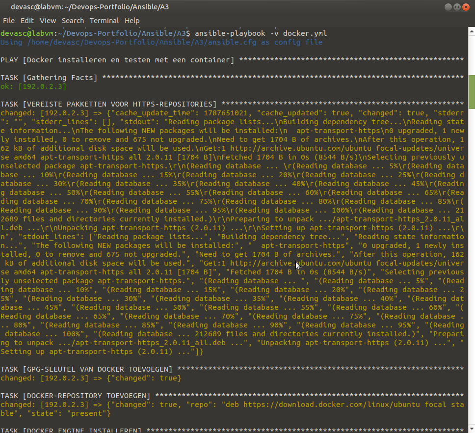
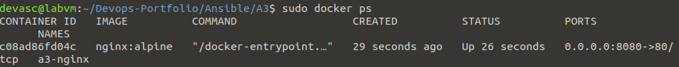
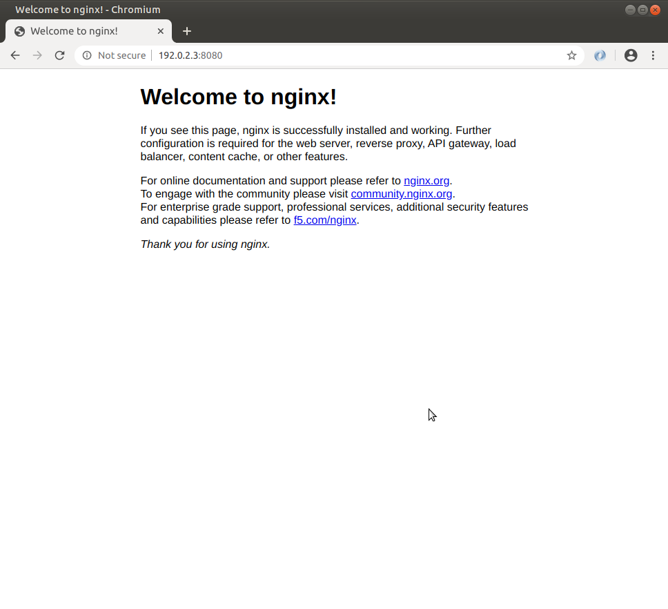

# A3 – Eigen playbook-experiment 2: Docker installeren

**In één zin:** een playbook dat Docker Engine installeert vanaf de officiële repository en meteen een nginx-container start als bewijs dat het werkt.

## Waarom dit experiment

A2 installeert Apache — één `apt`-taak, want dat pakket zit in de standaardrepository van Ubuntu. Docker niet. De officiële pakketten komen uit een eigen repository die je eerst moet toevoegen, met de bijbehorende GPG-sleutel.

Dat zijn vier stappen die je bij een handmatige installatie doet en vervolgens vergeet op te schrijven. Precies daarom horen ze in een playbook.

## Structuur

```
A3/
├── ansible.cfg
├── hosts
├── docker.yml
└── Img/
```

## Uitvoeren

```bash
sudo systemctl start ssh
ansible-playbook -v docker.yml
```

Dit duurt enkele minuten en heeft internet nodig.

Controleren:

```bash
sudo docker ps
curl http://192.0.2.3:8080
```





## De vier stappen die het verschil maken

```yaml
- apt: name=[apt-transport-https, ca-certificates, gnupg, ...]
- apt_key: url=https://download.docker.com/linux/ubuntu/gpg
- apt_repository: repo="deb https://download.docker.com/linux/ubuntu {{ ansible_distribution_release }} stable"
- apt: name=[docker-ce, docker-ce-cli, containerd.io]
```

De **GPG-sleutel** is een handtekening: hij bewijst dat de pakketten echt van Docker komen en onderweg niet gewijzigd zijn. Sla je die stap over, dan weigert `apt` de repository.

In de repository-regel staat `{{ ansible_distribution_release }}` — opnieuw een fact. Op de DEVASC VM wordt dat `focal`. Zo werkt hetzelfde playbook ook op een andere Ubuntu-versie zonder aanpassing.

## De container

```yaml
- name: TESTCONTAINER DRAAIEN
  docker_container:
    name: a3-nginx
    image: nginx:alpine
    published_ports:
      - "8080:80"
    restart_policy: unless-stopped
```

`8080:80` betekent: poort 8080 op de host, poort 80 in de container. `unless-stopped` zorgt dat de container na een herstart van de VM automatisch weer opkomt.

## Twee valkuilen

**De Python-library.** De module `docker_container` praat met Docker via een Python-library die niet vanzelf meekomt. Vandaar de aparte `pip`-taak. Zonder die stap: `Failed to import the required Python library (docker)`.

**De groep docker.** Deze taak slaagt, maar het effect merk je pas na opnieuw inloggen:

```yaml
- user: name=devasc groups=docker append=yes
```

Groepslidmaatschap wordt gelezen bij het aanmaken van je sessie. Draai je meteen daarna `docker ps` als devasc, dan krijg je nog altijd `permission denied` — niet omdat het playbook faalde, maar omdat je shell het nog niet weet. Oplossing: uitloggen en opnieuw inloggen, of `newgrp docker`, of voorlopig `sudo docker ps`.

## Opruimen na de demo

```bash
sudo docker stop a3-nginx
sudo docker rm a3-nginx
```

## Mogelijke vragen

**Waarom `nginx:alpine` en niet `nginx`?**
Alpine is een minimale Linux-basis. De image is ongeveer 40 MB in plaats van 190 MB — sneller binnengehaald, en minder software betekent minder kwetsbaarheden.

**Wat doet `wait_for`?**
Wachten tot poort 8080 antwoordt. De container is gestart voor nginx klaar is met opstarten; zonder wachten faalt de controle erna soms wel en soms niet. Dat soort tests noem je *flaky*, en die zijn erger dan geen test.

**Is dit playbook idempotent?**
Ja. Tweede run: `changed=0`. De repository staat er al, Docker is geïnstalleerd, de container draait.

**Verschil tussen een container en een virtuele machine?**
Een VM draait een compleet besturingssysteem met een eigen kernel. Een container deelt de kernel van de host en isoleert alleen de processen en bestanden. Daardoor start een container in seconden en een VM in minuten.

**Waarom draait nginx op 8080 en Apache uit A2 op 80?**
Twee diensten kunnen niet dezelfde poort gebruiken. Zo draaien ze naast elkaar.

## Verband met A2

| | A2 | A3 |
|---|---|---|
| Pakketbron | standaardrepository | eigen repository toevoegen |
| Aantal stappen | één `apt` | vier stappen voor de installatie kan |
| Resultaat | Apache op poort 80 | nginx in een container op 8080 |
| Extra afhankelijkheid | — | Python-library `docker` |

## Wat ik ondervond

<!-- Eén of twee eigen zinnen. Bijvoorbeeld over die permission denied bij
     docker ps, die eruitzag als een fout maar het niet was. -->
