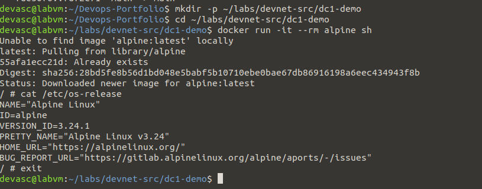
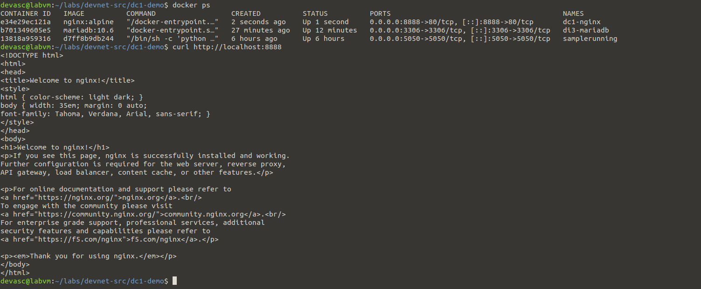
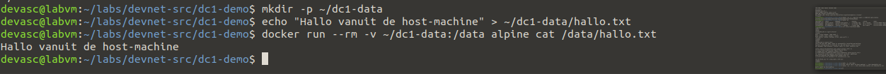
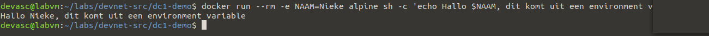
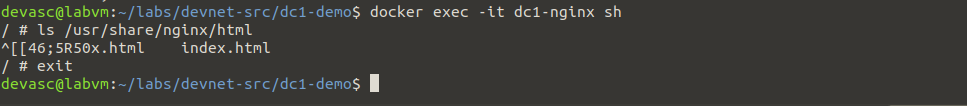

# Dc1 – Run containers-experiment

**In één zin:** vijf verschillende manieren om `docker run` en `docker exec` te gebruiken, naast elkaar getoond zodat het verschil duidelijk wordt.

## De vijf vormen

| Optie | Commando | Wat het toont |
|---|---|---|
| Interactief | `docker run -it --rm alpine sh` | een terminal ín de container, automatisch opgeruimd bij afsluiten |
| Achtergrond + poort | `docker run -d --name dc1-nginx -p 8888:80 nginx:alpine` | de container blijft draaien, bereikbaar via de hostpoort |
| Bind mount | `docker run --rm -v ~/dc1-data:/data alpine cat /data/hallo.txt` | een hostmap rechtstreeks zichtbaar maken in de container |
| Omgevingsvariabele | `docker run --rm -e NAAM=Nieke alpine sh -c '...'` | configuratie meegeven zonder de image aan te passen |
| Exec in draaiende container | `docker exec -it dc1-nginx sh` | binnengaan in een container die al loopt, in tegenstelling tot een nieuwe starten |

## Mogelijke vragen

**Wat is het verschil tussen `docker run` en `docker exec`?**
`run` maakt een **nieuwe** container van een image. `exec` voert een extra commando uit **in een container die al bestaat en draait**.

**Wat doet `--rm` precies?**
Verwijdert de container automatisch zodra hij stopt. Handig voor kortstondige, wegwerp-containers zoals demo's; niet voor containers die je wil kunnen herstarten met `docker start`.

**Verschil tussen een bind mount (`-v ~/pad:/data`) en een named volume (`-v naam:/data`, zie Di3)?**
Een bind mount wijst naar een specifiek pad op de host — jij kiest waar. Een named volume laat Docker zelf beheren waar de data feitelijk staat.

**Waarom werkt `docker exec -it dc1-nginx sh` en niet `bash`?**
Het `nginx:alpine`-image is gebaseerd op Alpine Linux, dat standaard geen `bash` heeft geïnstalleerd — enkel de kleinere `sh`.

## Wat ik ondervond

<!-- Eén of twee eigen zinnen, bijvoorbeeld over het verschil dat je zag tussen -it en -d. -->
