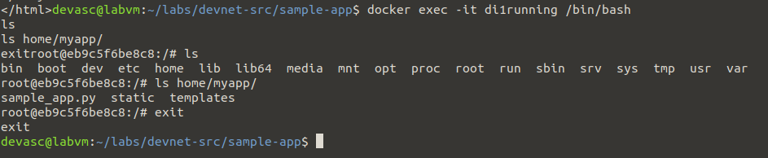
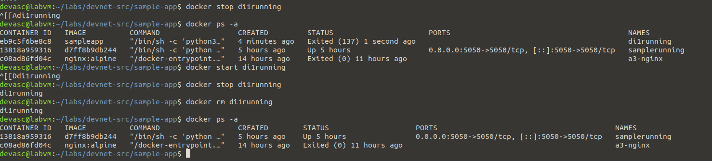

# Di1 – Lab 6.2.7: Build a Sample Web App in a Docker Container

**In één zin:** een Flask-webapp bouwen, en met één bash-script automatisch een Dockerfile genereren, het image bouwen, en de container starten.

## Waarom dit lab

Dit is de eerste keer in de cursus dat je zelf een Dockerfile **genereert** in plaats van er één te schrijven — met `echo "..." >> Dockerfile` regel per regel vanuit een bash-script. Dat is precies hoe een CI/CD-pipeline een Dockerfile zou opbouwen: reproduceerbaar, zonder handmatige tussenstap.

## De app zelf


Simpele Flask-app die het IP-adres van de aanroeper toont, gerenderd via `render_template("index.html")` met `{{request.remote_addr}}`.
## Een naamconflict onderweg

De eerste keer dat ik het script draaide, faalde `docker run` met `Conflict. The container name "/samplerunning" is already in use`. Ik had namelijk al een container met die naam draaien vanuit mijn Jenkins-lab (J1), op een andere poort (5050). Containernamen moeten uniek zijn op het hele systeem, ongeacht de poort. Oplossing: de containernaam in `sample-app.sh` veranderd naar `di1running`, zodat beide labs naast elkaar konden blijven draaien zonder dat ik de Jenkins-container hoefde te stoppen.

## Het script automatiseert vier dingen

1. Tijdelijke map met de sitebestanden.
2. Een Dockerfile, regel per regel via `echo >> Dockerfile`.
3. `docker build -t sampleapp .`
4. `docker run` met poort 8080 en de naam `samplerunning`.


Merk het IP-verschil op: lokaal `127.0.0.1`, via Docker `172.17.0.1` — het adres van de Docker-bridge, want de aanroep komt nu van buiten de container.

## De container van binnen



`docker exec -it samplerunning /bin/bash` geeft een shell **in** de container. `ls home/myapp/` toont exact de bestanden die de Dockerfile daar met `COPY` heeft neergezet.

## Opruimen



`docker stop` bevriest de container (staat blijft er, `docker ps -a` toont "Exited"). `docker rm` verwijdert hem echt. `docker start` op een gestopte container laat hem direct weer opstarten — dat is sneller dan opnieuw bouwen.

## Mogelijke vragen

**Waarom `FROM python` zonder versienummer?**
Dat pakt de laatste `python:latest`-tag. Voor een lab is dat prima; in productie zet je een vast versienummer (`python:3.11-slim`) zodat een image niet ongemerkt verandert bij een herbuild.

**Waarom moet je bestanden eerst naar `tempdir` kopiëren in plaats van direct te bouwen?**
`docker build` stuurt de hele "build context" (de map waarin je bouwt) naar de Docker-daemon. Een aparte, opgeruimde map met alleen wat de container nodig heeft, houdt die context klein en voorkomt dat je per ongeluk overbodige bestanden meestuurt.

**Wat is het verschil tussen `docker stop` en `docker rm`?**
`stop` zet de container stil maar hij bestaat nog (te herstarten met `docker start`). `rm` verwijdert hem definitief.

## Wat ik ondervond

Ik liep vast op een `Conflict. The container name "/samplerunning" is already in use`-foutmelding, en dacht eerst dat het aan de poort lag. Pas na het controleren van `docker ps -a` zag ik dat een compleet andere oefening (Jenkins) toevallig dezelfde containernaam gebruikte op een andere poort — dat leerde me dat containernamen systeembreed uniek moeten zijn, los van de poort. Door de naam in mijn script aan te passen naar iets unieks (`di1running`) was het probleem meteen opgelost.
```
