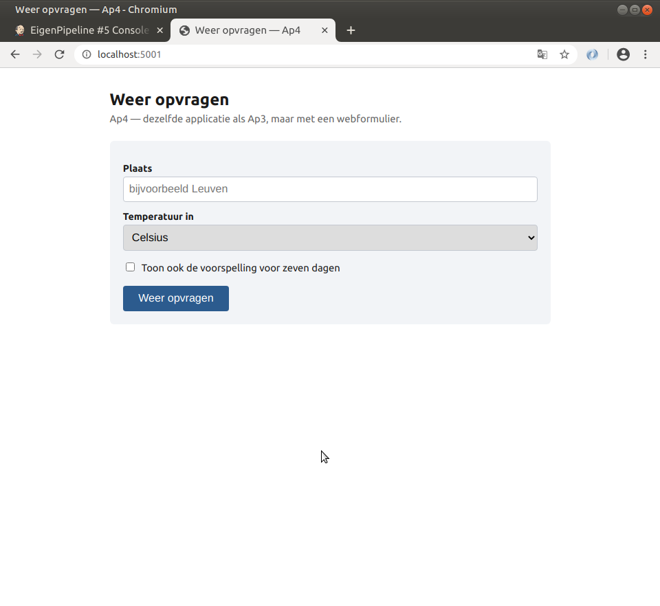
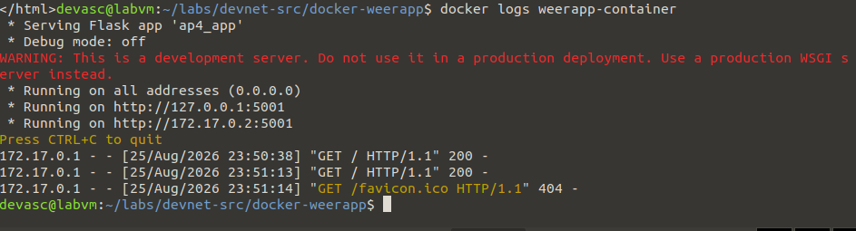

# Di2 – Eigen image-experiment: mijn weerapp als Docker-image

**In één zin:** mijn eigen Flask-weerwebform (Ap4) in een Docker-container draaien, met een handgeschreven Dockerfile in plaats van een gegenereerde.

## Waarom dit experiment

Di1 laat Docker zien via een lab-app en een Dockerfile die door een script wordt opgebouwd. Ik wilde weten of ik zelf, zonder dat script, een correcte Dockerfile kan schrijven voor een eigen app — en of een container die een externe API aanroept (Open-Meteo) gewoon internettoegang heeft zonder extra configuratie.

## De Dockerfile

```dockerfile
FROM python:3.9-slim
WORKDIR /app
COPY requirements.txt .
RUN pip install --no-cache-dir -r requirements.txt
COPY ap4_app.py .
COPY templates ./templates
EXPOSE 5001
CMD ["python3", "ap4_app.py"]
```

Verschillen met Di1's aanpak:

| | Di1 | Di2 |
|---|---|---|
| Dockerfile | gegenereerd via `echo >> Dockerfile` in een bash-script | met de hand geschreven |
| Basisimage | `python` (latest) | `python:3.9-slim` — vast versienummer, kleiner |
| App | lab-voorbeeld | eigen weerwebform (Ap4), roept een externe API aan |
| Dependencies | los geïnstalleerd met `RUN pip install flask` | vastgelegd in `requirements.txt` |

## Resultaat





De container haalt zonder extra instellingen weerdata op bij Open-Meteo — Docker geeft een container standaard uitgaande internettoegang.

## Mogelijke vragen

**Waarom `python:3.9-slim` in plaats van `python`?**
`slim` is een kleinere basisimage zonder overbodige tools. Een vast versienummer voorkomt dat een herbuild maanden later ongemerkt een andere Python-versie meebrengt.

**Waarom een `requirements.txt` in plaats van losse `RUN pip install`-regels?**
Eén bestand dat exact vastlegt welke libraries en versies nodig zijn — makkelijker te onderhouden en te hergebruiken buiten Docker (bijvoorbeeld in een venv, zie Pv1).

**Hoe komt de container aan internettoegang voor de weer-API?**
Docker maakt standaard een virtueel netwerk (`docker0`/`bridge`) met NAT naar de host. Containers kunnen daardoor uitgaand verkeer sturen zonder dat je iets hoeft te configureren; binnenkomend verkeer moet je wél expliciet publiceren met `-p`.

**Waarom poort 5001 en niet 5000 of 8080?**
5000 kan al bezet zijn door andere Flask-experimenten, 8080 door Jenkins of de Di1-container. 5001 is vrij.

## Wat ik ondervond
Het bouwen van mijn eigen image liet zien hoe rechtstreeks de code uit Ap4 hergebruikt kon worden — enkel een Dockerfile en een requirements.txt waren nodig om exact dezelfde applicatie in een draagbare container te krijgen. Ik heb wel eerst vergeten de `templates/`-map mee te kopiëren in de Dockerfile, waardoor de container opstartte maar een `TemplateNotFound`-fout gaf; na het toevoegen van `COPY templates/ templates/` werkte alles.
```

---
