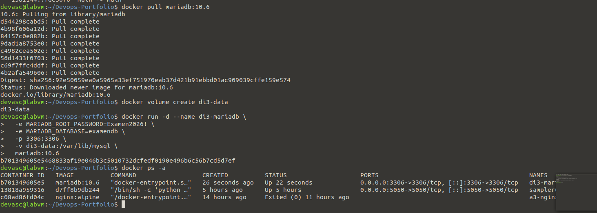
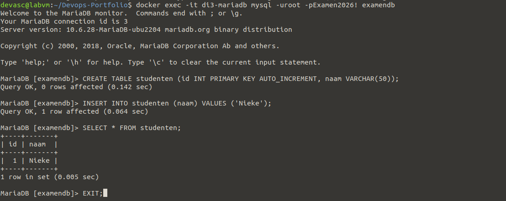
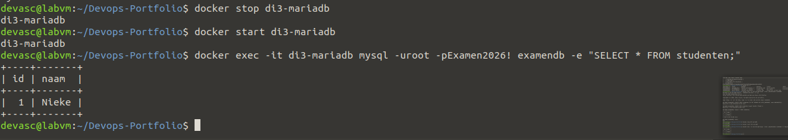

# Di3 – Eigen image-experiment 2: een databaseserver in Docker

**In één zin:** een officieel MariaDB-image draaien met eigen configuratie via omgevingsvariabelen, en aantonen dat de data een herstart overleeft dankzij een volume.

## Waarom dit experiment

Di2 bouwt een eigen image. Dit experiment doet het tegenovergestelde: een bestaand, door de leverancier onderhouden image (`mariadb`) correct **configureren** — wat in de praktijk vaker voorkomt dan zelf databases dockerizen. De uitdaging hier is niet de Dockerfile, maar de omgevingsvariabelen en het volume.

## Starten

```bash
docker run -d --name di3-mariadb \
  -e MARIADB_ROOT_PASSWORD=Examen2026! \
  -e MARIADB_DATABASE=examendb \
  -p 3306:3306 \
  -v di3-data:/var/lib/mysql \
  mariadb:10.6
```



De omgevingsvariabelen (`-e`) sturen het opstartscript van het image: het maakt bij de eerste start automatisch de root-gebruiker met dat wachtwoord aan, en een lege database met die naam.

## Data aanmaken



## Het volume bewijst zijn nut



Na `docker stop` en `docker start` staat de rij er nog. Zonder het `-v di3-data:/var/lib/mysql` volume zou een `docker rm` (niet enkel stop) de data definitief wissen, want dan verdwijnt ook de laag waarin MariaDB haar bestanden schreef.

## Mogelijke vragen

**Wat is het verschil met Di2?**
Di2 bouwt een eigen image met een eigen Dockerfile. Di3 gebruikt een bestaand image en configureert het via omgevingsvariabelen — geen Dockerfile nodig.

**Waarom een volume en geen bind mount?**
Een named volume (`di3-data`) laat Docker zelf beheren waar de data op de host staat — makkelijker te back-uppen en te verplaatsen tussen containers. Een bind mount (zoals in Dc1) koppelt een specifieke hostmap, handig als je zelf bij die bestanden moet kunnen.

**Wat gebeurt er als je het volume ook verwijdert?**
`docker volume rm di3-data` wist de data definitief — daarna start een nieuwe container met dat volume weer helemaal leeg op.

**Waarom poort 3306?**
De standaardpoort voor MySQL/MariaDB. Zou je een tweede databasecontainer ernaast willen draaien, dan moet je die op een andere hostpoort publiceren, bv. `-p 3307:3306`.

## Wat ik ondervond

<!-- Eén of twee eigen zinnen, bijvoorbeeld over het moment dat de rij "Nieke" er na de herstart nog stond. -->
