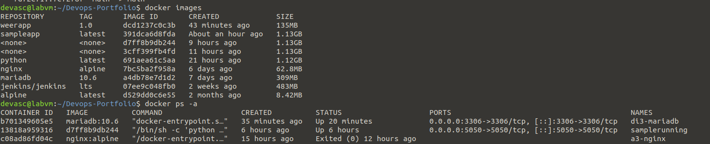
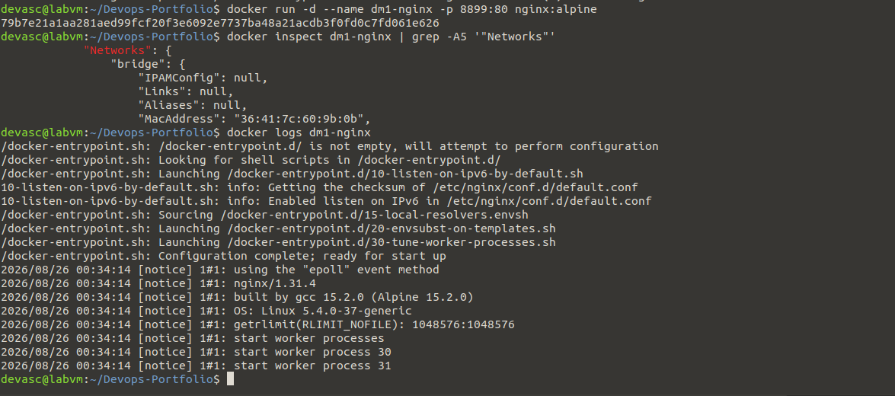
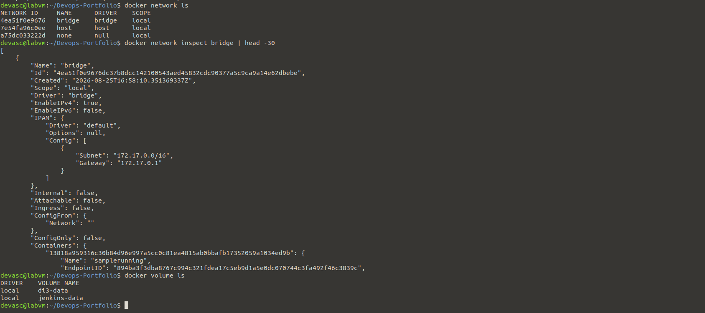
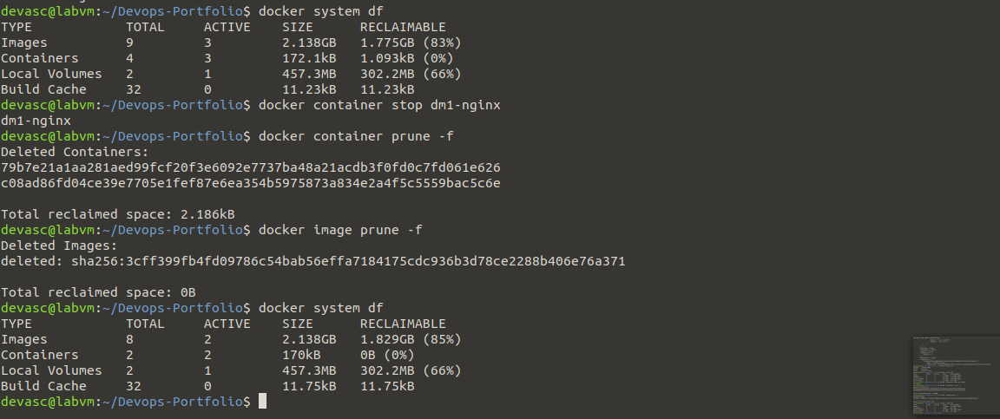

# Dm1 – Docker management-experiment

**In één zin:** niet containers draaien, maar ze en hun onderliggende resources (images, netwerken, volumes, schijfruimte) beheren en opruimen.

## Overzicht opvragen

`docker images` toont wat lokaal is gedownload of gebouwd. `docker ps -a` toont elke container die ooit gemaakt is, ook gestopte.

## Eén container van binnen bekijken zonder erin te gaan

`docker inspect` geeft de volledige configuratie van een container terug als JSON — hier gefilterd op het netwerkgedeelte. `docker logs` toont wat het proces in de container naar stdout/stderr heeft geschreven, zonder dat je moet inloggen op de container.

## Netwerken en volumes

Elke container hangt standaard aan het `bridge`-netwerk. `docker network inspect bridge` toont welke containers daar op dit moment aan gekoppeld zijn en met welk IP.

## Opruimen

`docker system df` toont hoeveel schijfruimte images, containers en volumes innemen. `docker container prune` en `docker image prune` verwijderen wat gestopt/ongebruikt is — vergelijk de twee `system df`-uitvoeren om het vrijgemaakte verschil te zien.

## Mogelijke vragen

**Wat is het verschil tussen dit experiment en Dc1?**
Dc1 gaat over het **starten** van containers met verschillende opties. Dm1 gaat over het **beheren** van wat er al staat: inspecteren, opruimen, ruimte vrijmaken.

**Waarom zou je containers/images regelmatig "prunen"?**
Elke gestopte container en elk ongebruikt image blijft schijfruimte innemen tot je het expliciet verwijdert. Op een CI-server die continu bouwt, loopt dat snel op tot gigabytes.

**Wat toont `docker network inspect bridge` dat `docker ps` niet toont?**
Het interne IP-adres van elke container binnen dat netwerk, en welke containers onderling met elkaar kunnen praten.

**Is `docker system df` hetzelfde als het Linux-commando `df`?**
Nee. Het gewone `df` toont schijfgebruik van de hele machine; `docker system df` toont specifiek hoeveel daarvan door Docker-images, -containers en -volumes wordt ingenomen.

## Wat ik ondervond

<!-- Eén of twee eigen zinnen, bijvoorbeeld over hoeveel ruimte prune vrijmaakte. -->
