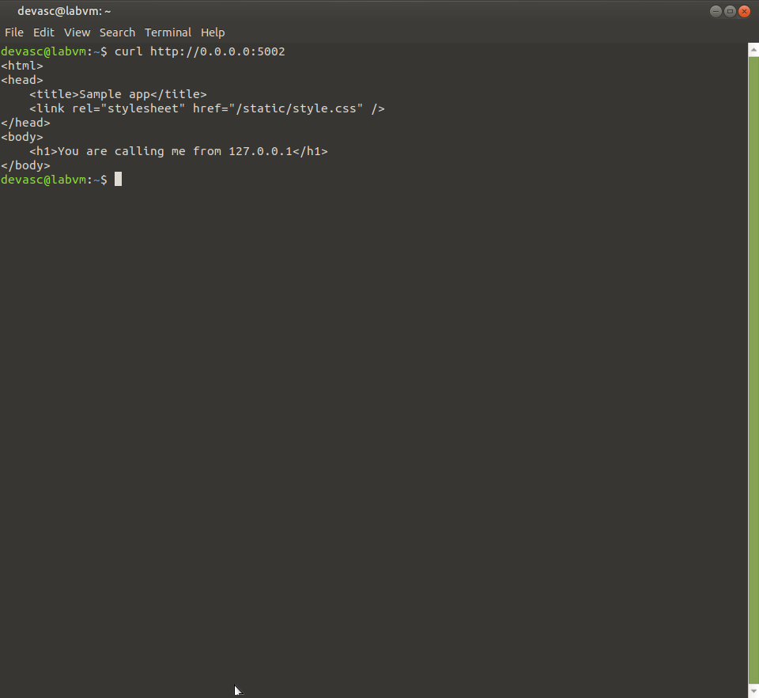

# Pf1 – Flask-experiment gebaseerd op lab 6.3.6

**In één zin:** dezelfde Flask-app als in het Jenkins-lab (J1/Di1), maar hier bekeken als microservice op zich: routing, request-object, en templaterendering — los van CI/CD of Docker.

## De kern van Flask

```python
sample = Flask(__name__)

@sample.route("/")
def main():
    return render_template("index.html")

if __name__ == "__main__":
    sample.run(host="0.0.0.0", port=5002)
```

`@sample.route("/")` koppelt een URL-pad aan een functie — dat heet routing. `render_template` leest `templates/index.html` en vervangt `{{request.remote_addr}}` door het echte IP-adres van de aanroeper.



## Mogelijke vragen

**Waarom dezelfde app als in J1 en Di1?**
Om te tonen dat één stuk code vanuit drie invalshoeken bekeken kan worden: als CI/CD-doelwit (J1), als containerworkload (Di1), en als Flask-microservice op zich (Pf1). Het is dezelfde code, maar wat je erover vertelt verschilt per experiment.

**Wat is `request.remote_addr`?**
Een eigenschap van Flask's `request`-object die het IP-adres van de client teruggeeft die de aanvraag deed.

**Waarom `host="0.0.0.0"` en niet `127.0.0.1`?**
`0.0.0.0` betekent: luister op alle netwerkinterfaces van deze machine, niet enkel de loopback. Nodig zodra iets van buiten de container/VM moet kunnen verbinden.

## Wat ik ondervond

## Wat ik ondervond

Dit was mijn eerste kennismaking met Flask binnen dit vak, dus vooral de basisstructuur (`@app.route`, `render_template`, `request.form`) moest ik even laten bezinken. Zodra ik begreep dat `request.method` bepaalt welke tak van de functie wordt uitgevoerd, viel de rest van de latere, complexere Flask-oefeningen (Pf2, Pf3) een stuk makkelijker te volgen.
```

---
