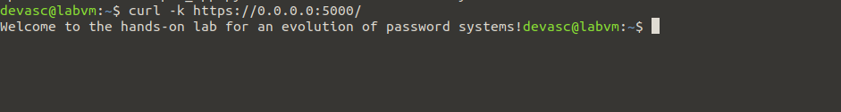
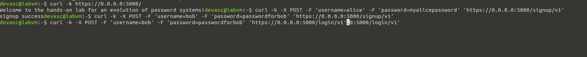
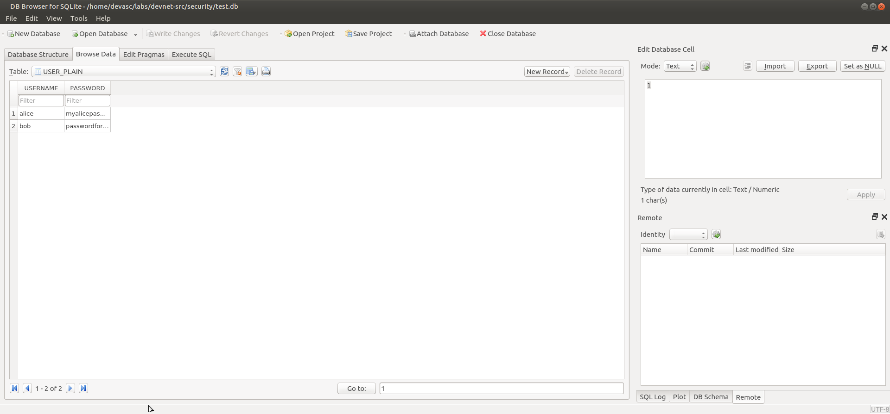
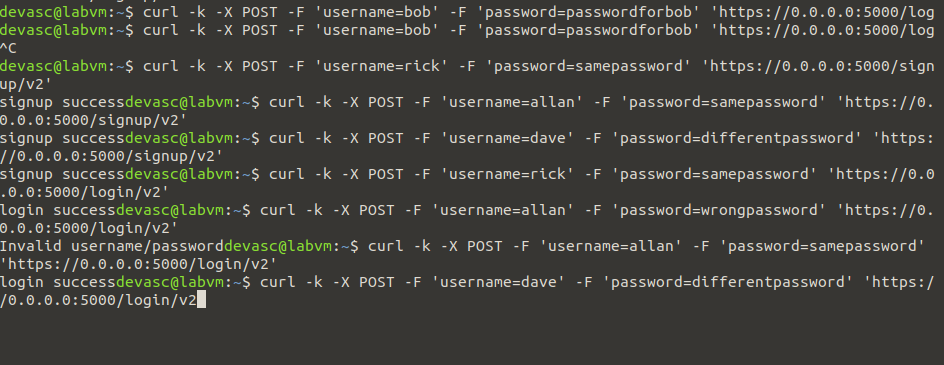

# Pf2 – Logon-page experiment (Lab 6.5.10: Evolution of Password Methods)

**In één zin:** dezelfde signup/login-functionaliteit twee keer bouwen — eerst met plaintext-wachtwoorden, dan met SHA-256-hashes — om met eigen ogen te zien waarom plaintext onveilig is én waarom een hash zonder salt ook nog een zwakte heeft.

## Versie 1: plaintext

```python
c.execute("INSERT INTO USER_PLAIN (USERNAME,PASSWORD) VALUES ('{0}', '{1}')"
          .format(request.form['username'], request.form['password']))
```





Wie ook maar leestoegang tot `test.db` krijgt, ziet meteen alle wachtwoorden. Geen enkele barrière.

## Versie 2: SHA-256-hash

```python
hash_value = hashlib.sha256(request.form['password'].encode()).hexdigest()
c.execute("INSERT INTO USER_HASH (USERNAME, HASH) VALUES ('{0}', '{1}')"
          .format(request.form['username'], hash_value))
```




## Het lek dat een hash zonder salt overlaat

`rick` en `allan` gebruikten toevallig hetzelfde wachtwoord (`samepassword`). In de `USER_HASH`-tabel hebben ze **exact dezelfde hash-waarde**. Wie de database steelt, ziet meteen welke gebruikers hetzelfde wachtwoord delen — en als hij van één van hen het plaintext-wachtwoord kent (via een datalek elders, phishing, …), kent hij het van de ander ook. Dat heet een **rainbow table**-aanval: vooraf berekende hashes van veelgebruikte wachtwoorden vergelijken met wat in de database staat.

De oplossing is **salting**: aan elk wachtwoord een unieke, willekeurige waarde toevoegen vóór het hashen, zodat identieke wachtwoorden nooit dezelfde hash opleveren. Dat deed dit lab bewust niet, net om het probleem zichtbaar te maken.

## Mogelijke vragen

**Waarom `ssl_context='adhoc'`?**
Laat Flask draaien over HTTPS met een zelfondertekend certificaat, zonder dat je een echt certificaat hoeft aan te vragen. Vandaar ook de `-k`-vlag bij curl: die zegt "vertrouw dit zelfondertekende certificaat toch".

**Waarom kan je een hash niet terugrekenen naar het wachtwoord?**
SHA-256 is een eenrichtings-functie: makkelijk om van wachtwoord naar hash te gaan, praktisch onmogelijk om vanuit de hash het wachtwoord terug te vinden — behalve door te raden en elke gok te hashen (brute force), wat een salt juist trager/onwerkbaar maakt.

**Wat doet `nohup ... &`?**
Start het proces op de achtergrond en laat het doorlopen ook als je de terminal zou sluiten. De uitvoer gaat naar `nohup.out` in plaats van naar je scherm.

**Is dit een veilige manier om wachtwoorden op te slaan in een echt systeem?**
Nog niet volledig: een productiesysteem gebruikt ook een salt en een trager hash-algoritme dat specifiek voor wachtwoorden ontworpen is (bcrypt, scrypt, of Argon2), juist omdat SHA-256 té snel is — een aanvaller kan er miljarden per seconde van proberen.

## Wat ik ondervond

<!-- Eén of twee eigen zinnen, bijvoorbeeld over het moment dat je zag dat rick en allan dezelfde hash hadden. -->
