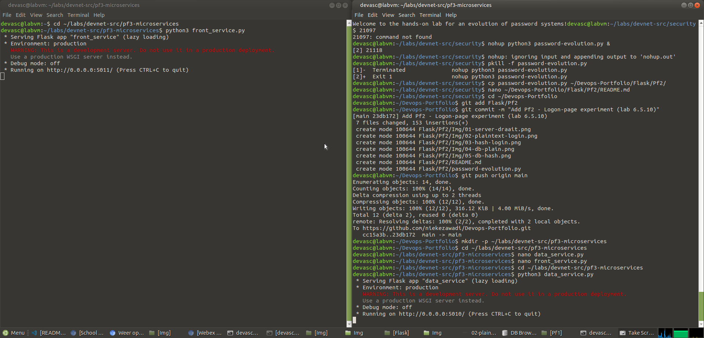
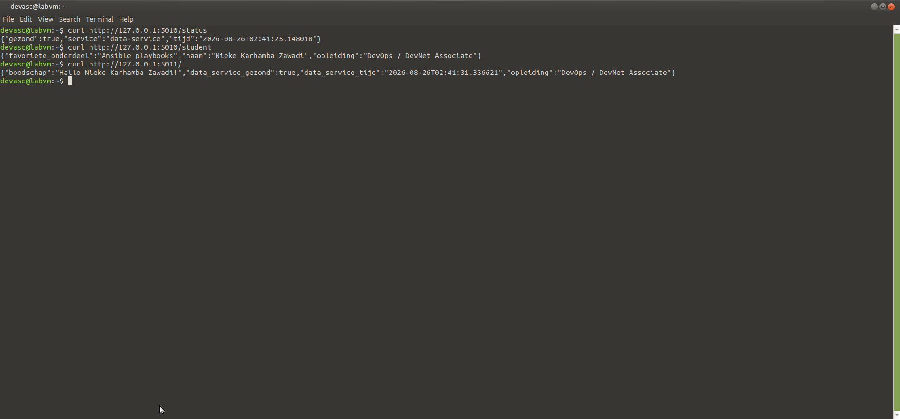
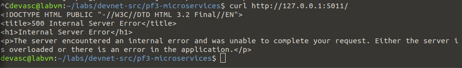

# Pf3 – Eigen microservice-experiment: twee services die met elkaar praten

**In één zin:** een `data-service` en een `front-service`, elk een aparte Flask-app op een eigen poort, waarbij de front-service via HTTP data ophaalt bij de data-service — het kernidee van microservices in het klein.

## Waarom dit experiment

Pf1 en Pf2 draaien allebei als één Flask-app. Een echte microservice-architectuur bestaat uit **meerdere onafhankelijke services** die elkaar over het netwerk aanroepen, elk met hun eigen verantwoordelijkheid en eigen levenscyclus. Dit experiment bouwt de kleinst mogelijke versie daarvan.

## De twee services

| | Poort | Taak |
|---|---|---|
| `data-service` | 5010 | houdt gegevens bij, geeft ze als JSON terug |
| `front-service` | 5011 | roept `data-service` aan via `requests.get()`, combineert het resultaat |

## Het bewijs dat het écht twee aparte processen zijn

Als ik `data_service.py` stop, breekt `front_service.py` — niet omdat de code fout is, maar omdat de service waarvan hij afhangt er niet meer is. Dat is precies het compromis van microservices: onafhankelijk schaalbaar en vervangbaar, maar met een nieuwe faalmodus die een monoliet niet kent — een netwerkaanroep die kan mislukken.

## Mogelijke vragen

**Wat maakt dit "microservices" en niet gewoon twee scripts?**
Elke service is onafhankelijk deploybaar, herstart-baar en vervangbaar zonder de andere aan te raken, en ze communiceren uitsluitend via een netwerk-interface (HTTP/JSON) — niet via gedeelde code of een gedeeld geheugen.

**Wat gebeurt er als `data-service` traag antwoordt in plaats van uit te vallen?**
Zonder de `timeout=3` in `requests.get()` zou `front-service` daar oneindig op kunnen blijven wachten. Een timeout is een basisbescherming tegen een trage afhankelijkheid die de hele keten blokkeert.

**Hoe zou je dit in Docker draaien?**
Elke service in zijn eigen container (vergelijkbaar met Di2), met een gedeeld Docker-netwerk zodat ze elkaar bij naam kunnen bereiken in plaats van via `127.0.0.1`.

**Wat is het risico van deze opzet vergeleken met één monoliet?**
Meer bewegende delen: twee processen om te starten, te monitoren en te deployen, en een netwerkaanroep die kan mislukken waar een functieaanroep in een monoliet dat niet zou kunnen.

## Wat ik ondervond

<!-- Eén of twee eigen zinnen, bijvoorbeeld over het moment dat je de foutpagina zag verschijnen nadat je data-service stopte. -->
