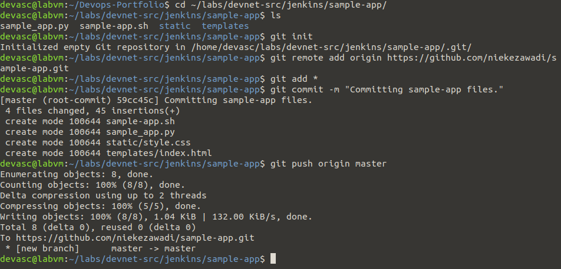
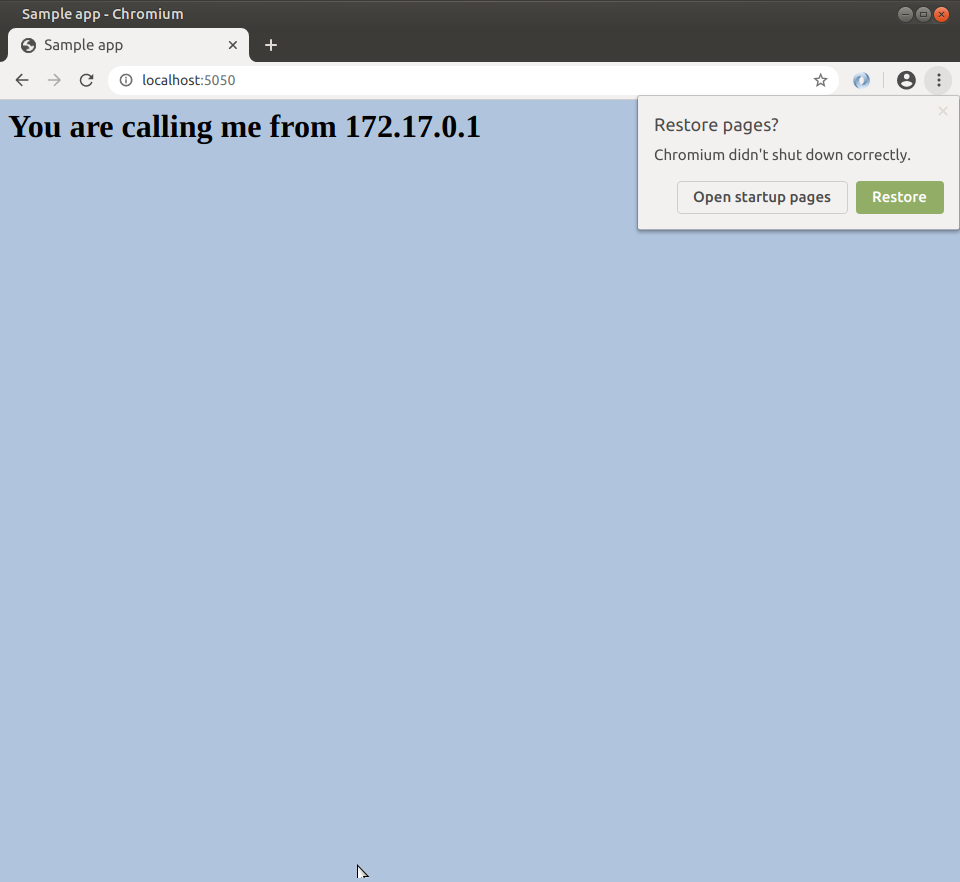
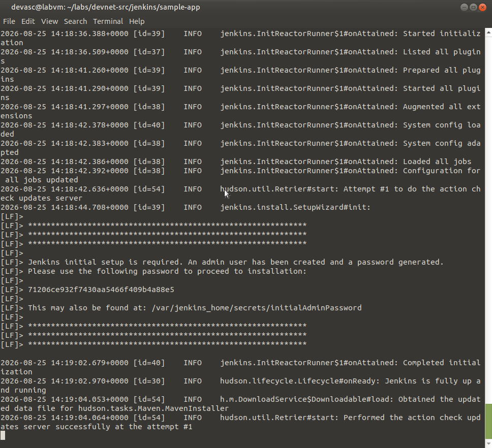
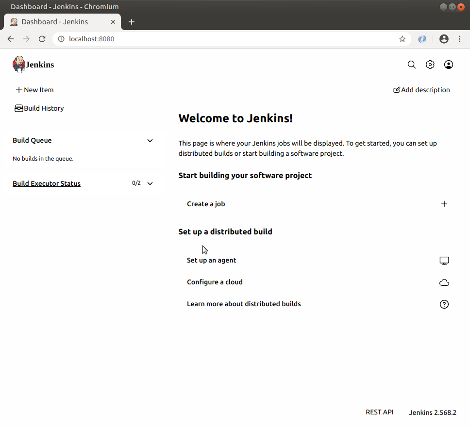
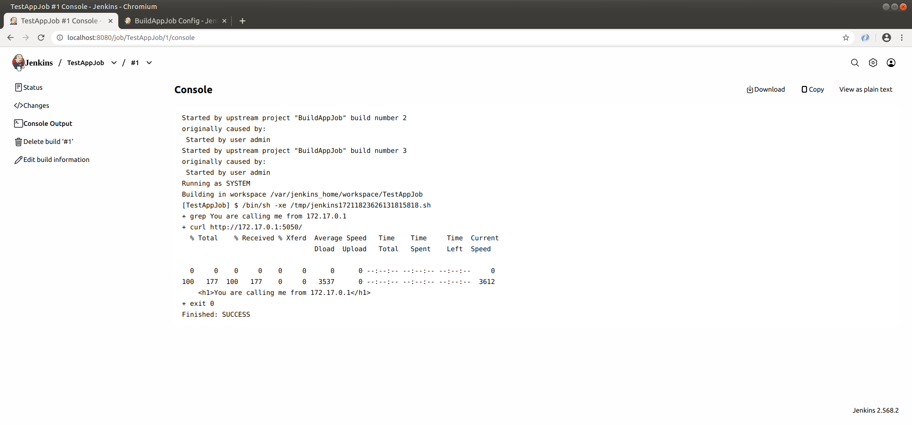
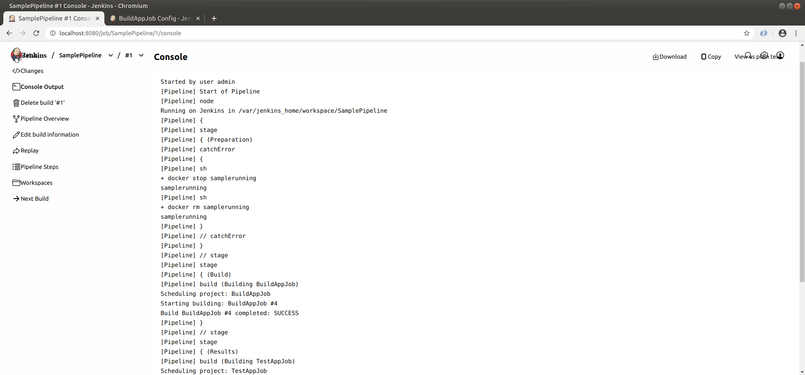
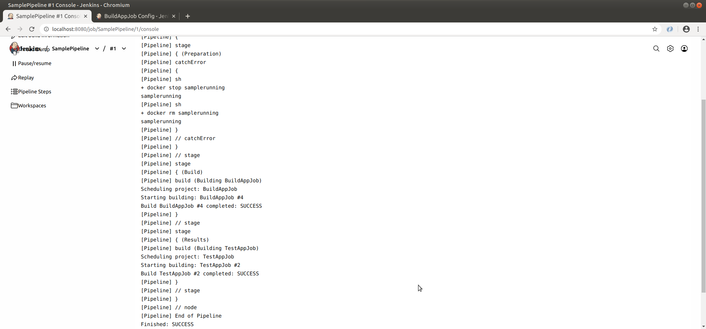

# J1 – Lab 6.3.6: Build a CI/CD Pipeline Using Jenkins

**In één zin:** een Flask-app naar GitHub pushen, Jenkins in een container draaien, en die Jenkins de app laten ophalen, bouwen, testen en in een pipeline aan elkaar knopen.

**Werkmap:** `~/labs/devnet-src/jenkins/sample-app`

---

## Waarschuwing vooraf: de poort

Jenkins draait op **8080**. Draait daar nog iets anders — bijvoorbeeld de nginx-container uit A3 — dan start Jenkins niet.

```bash
sudo docker ps
sudo docker stop a3-nginx
```

De sample-app draait daarom op **5050** in plaats van 8080. Dat is stap 1 van het lab en de reden dat je die poort moet aanpassen.

## 1 · De sample-app naar GitHub

Repository `sample-app` aanmaken op GitHub, dan lokaal:

```bash
cd ~/labs/devnet-src/jenkins/sample-app/
git init
git remote add origin https://github.com/niekezawadi/sample-app.git
git add *
git commit -m "Committing sample-app files."
git push origin master
```

Wachtwoord = je **Personal Access Token**, niet je GitHub-wachtwoord.



## 2 · Poort 8080 → 5050

In `sample_app.py`, één plek:

```python
sample.run(host="0.0.0.0", port=5050)
```

In `sample-app.sh`, drie plekken: de `EXPOSE`-regel in de Dockerfile en de twee helften van `-p 5050:5050`.

Bouwen en controleren:

```bash
bash ./sample-app.sh
```

Browser naar `localhost:5050` → *You are calling me from 172.17.0.1*.



Dan pushen:

```bash
git add *
git commit -m "Changed port from 8080 to 5050."
git push origin master
```

## 3 · Jenkins in een container

```bash
docker pull jenkins/jenkins:lts
```

Op **één regel**:

```bash
docker run --rm -u root -p 8080:8080 -v jenkins-data:/var/jenkins_home -v $(which docker):/usr/bin/docker -v /var/run/docker.sock:/var/run/docker.sock -v "$HOME":/home --name jenkins_server jenkins/jenkins:lts
```

Wat elke optie doet:

| Optie | Betekenis |
|---|---|
| `--rm` | container verwijderen zodra hij stopt |
| `-u root` | draaien als root, zodat Jenkins docker-commando's mag |
| `-p 8080:8080` | Jenkins bereikbaar op localhost:8080 |
| `-v jenkins-data:/var/jenkins_home` | waar Jenkins zijn gegevens bewaart |
| `-v $(which docker):/usr/bin/docker` | het docker-commando naar binnen halen |
| `-v /var/run/docker.sock:...` | Jenkins laten praten met de Docker van de host |

Dat laatste is **Docker-in-Docker**: een container die zelf containers start.



Het beginwachtwoord staat in de uitvoer. Kwijt? Haal het op in een tweede terminal:

```bash
docker exec -it jenkins_server /bin/bash
cat /var/jenkins_home/secrets/initialAdminPassword
exit
```

**Laat het eerste terminalvenster open staan** — sluit je dat, dan stopt Jenkins.

## 4 · Jenkins configureren

Browser naar `localhost:8080`, wachtwoord plakken, dan:

- **Install suggested plugins** — duurt enkele minuten
- **Skip and continue as admin**
- Instance Configuration → **Save and Finish**
- **Start using Jenkins**



## 5 · BuildAppJob

**New Item** → naam `BuildAppJob` → **Freestyle project** → OK.

| Tabblad | Instelling |
|---|---|
| General | beschrijving: *My first Jenkins job* |
| Source Code Management | **Git**, URL `https://github.com/niekezawadi/sample-app.git` |
| Credentials | **Add** → Jenkins → GitHub-gebruikersnaam + **token** als wachtwoord |
| Build | Add build step → **Execute shell** → `bash ./sample-app.sh` |

**Build Now**, dan links onder *Build History* op je buildnummer, dan **Console Output**.


Onderaan zie je `Finished: SUCCESS` en een `docker ps -a` met **twee** containers: je sample-app op 5050 en Jenkins zelf op 8080.

## 6 · TestAppJob

Eerst de draaiende container opruimen, anders botst de volgende build:

```bash
docker stop samplerunning
docker rm samplerunning
```

**New Item** → `TestAppJob` → Freestyle project.

| Tabblad | Instelling |
|---|---|
| Source Code Management | **None** |
| Build Triggers | **Build after other projects are built** → `BuildAppJob` |
| Build | Execute shell → het script hieronder |

```bash
if curl http://172.17.0.1:5050/ | grep "You are calling me from 172.17.0.1"; then
   exit 0
else
   exit 1
fi
```

`exit 0` betekent geslaagd, `exit 1` betekent mislukt. Zo weet Jenkins of de test doorging.



Waarom `172.17.0.1` en niet `localhost`? Dat is het adres van de host **gezien vanuit een container**. Jenkins draait zelf in een container, dus `localhost` zou naar Jenkins zelf wijzen.

## 7 · SamplePipeline

**New Item** → `SamplePipeline` → **Pipeline**.

In het Pipeline-vak:

```groovy
node {
    stage('Preparation') {
        catchError(buildResult: 'SUCCESS') {
            sh 'docker stop samplerunning'
            sh 'docker rm samplerunning'
        }
    }
    stage('Build') {
        build 'BuildAppJob'
    }
    stage('Results') {
        build 'TestAppJob'
    }
}
```

**Build Now** → in de **Stage View** verschijnen drie groene blokken met de duur per stage.




`catchError` vangt de fout op als er nog geen container draaide om te stoppen. Zonder dat zou de eerste run altijd falen.

---

## Mogelijke vragen

**Wat is CI/CD?**
Continuous Integration: elke wijziging wordt automatisch gebouwd en getest. Continuous Delivery: het resultaat is altijd klaar om uitgerold te worden. De pipeline is de keten die dat afdwingt.

**Wat is een job in Jenkins?**
De basiseenheid. Een job haalt code op, voert een script uit, en meldt of dat lukte. Een pipeline knoopt jobs aan elkaar.

**Waarom draait Jenkins in een container?**
Geen installatie op je machine, geen versieconflicten, en weggooien is één commando. De prijs is dat je de Docker-socket naar binnen moet mounten, want anders kan Jenkins zelf geen containers starten.

**Wat is Docker-in-Docker?**
Jenkins draait in een container en start zelf containers. In dit lab gebeurt dat niet met een echte Docker-daemon binnenin, maar door de socket van de host te delen — dat is lichter.

**Wat betekent `exit 0` en `exit 1`?**
De exitcode van een script. 0 is geslaagd, alles daarboven is mislukt. Jenkins leest die code om te bepalen of een build slaagt.

**Waarom moet de app op 5050 en niet op 8080?**
Jenkins bezet 8080. Twee processen kunnen niet op dezelfde poort luisteren.

**Wat doet `catchError`?**
Een fout opvangen zonder de hele pipeline te laten falen. Nuttig bij opruimstappen die de eerste keer niets te doen hebben.

## Wat ik ondervond

<!-- Eén of twee eigen zinnen. Bijvoorbeeld over de poortbotsing met je
     A3-container, of over 172.17.0.1 tegenover localhost. -->
