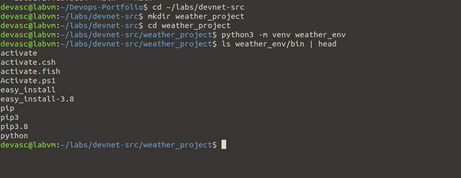
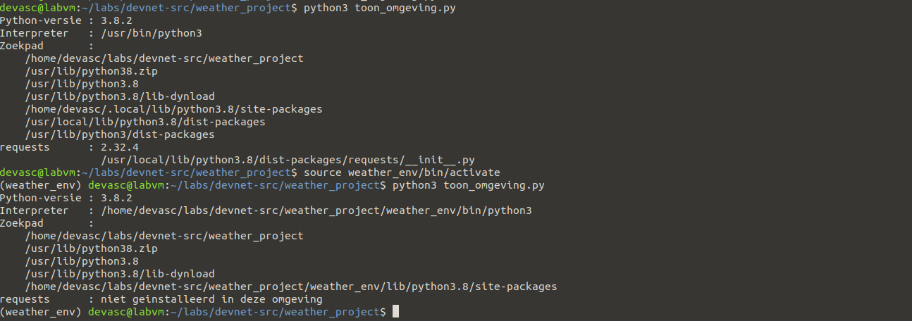
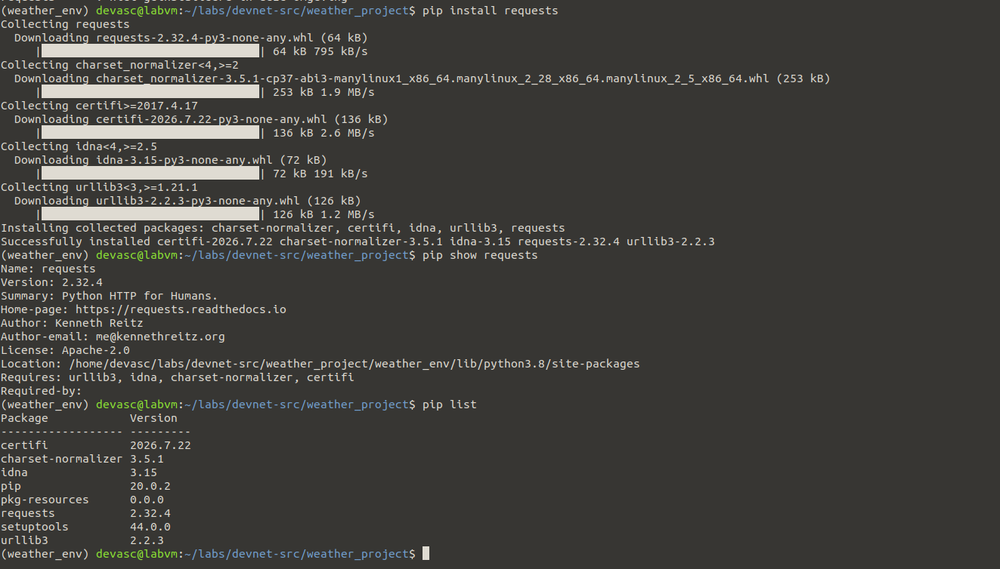
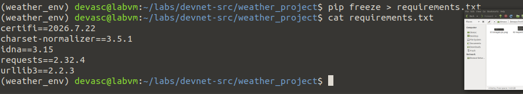

# Pv1 – Venv lab-experiment (slides)

**In één zin:** een virtuele omgeving aanmaken, activeren, er een library in installeren, en aantonen dat die buiten die omgeving niet bestaat.

**Bron:** presentatie 6, *Python Working Environments* — het `weather_project`-voorbeeld.

## Wat een venv is

Een virtuele omgeving is een map met een eigen `bin/` en `lib/`, plus een symbolische link naar één Python-interpreter. Activeren zet die map vooraan in `$PATH`. Meer magie zit er niet achter.

Waarom je dat wil: twee projecten op één machine kunnen verschillende versies van dezelfde library nodig hebben. Zonder venv installeer je alles in dezelfde systeem-Python en botsen ze.

## De stappen

Vóór activeren is de interpreter `/usr/bin/python3`. Na activeren wijst hij naar `.../weather_project/weather_env/bin/python3`. Dat verschil is het bewijs dat de omgeving echt gescheiden is.

## Mogelijke vragen

**Zet je de venv-map in Git?**
Nee. Alleen `requirements.txt`. De map bevat binaire bestanden en machine-specifieke paden.

**Wat doet `source` precies?**
Het voert het activate-script uit in je huidige shell in plaats van in een nieuwe. Zou je `./activate` doen, dan verandert er niets aan je eigen shell en werkt het niet.

**Verschil met `pip install --user`?**
Dat installeert in je thuismap, maar nog altijd in één gedeelde set. Twee projecten met verschillende versies botsen dan nog steeds.

## Wat ik ondervond

<!-- Eén of twee eigen zinnen. -->
