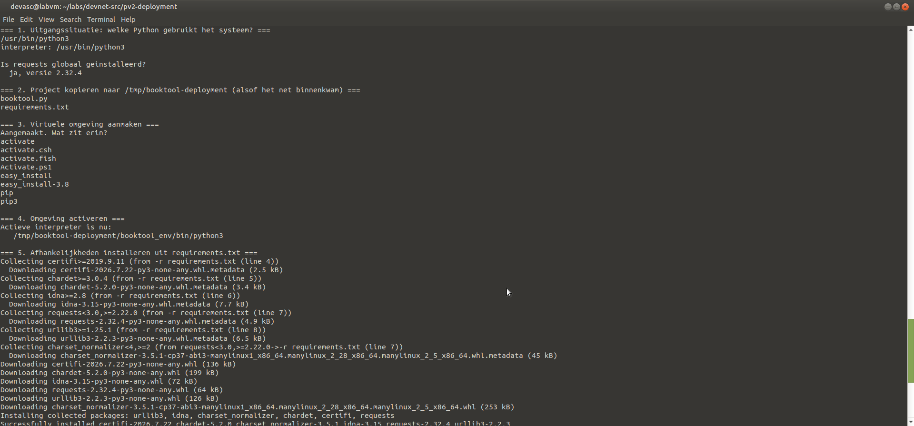

# Pv2 – Eigen venv-experiment (deployment)

**In één zin:** een script dat naspeelt wat er gebeurt als een project op een andere machine belandt — alleen broncode en `requirements.txt`, en daaruit wordt de omgeving opnieuw opgebouwd.

## Uitvoeren

```bash
chmod +x deploy.sh
./deploy.sh
```



## De zeven stappen

1. Uitgangssituatie — welke Python gebruikt het systeem, en is `requests` globaal geïnstalleerd?
2. Kopiëren naar `/tmp/booktool-deployment` — alleen broncode, geen venv.
3. `python3 -m venv booktool_env` — de omgeving aanmaken.
4. Activeren, en zien dat `sys.executable` verandert.
5. `pip install -r requirements.txt` — de afhankelijkheden herstellen.
6. De applicatie draaien in de nieuwe omgeving.
7. `deactivate` — en zien dat de interpreter weer de systeem-Python is.

## Waarom dit ertoe doet

Twee projecten op één machine kunnen verschillende versies van dezelfde library nodig hebben. Zonder venv installeer je alles in dezelfde systeem-Python en botsen ze. Dat is ook wat een Docker-image doet, één laag hoger — daar isoleer je niet alleen de libraries maar het hele besturingssysteem.

## Mogelijke vragen

**Zet je de venv-map in Git?**
Nee. Alleen `requirements.txt`.

**Wat doet `set -e` bovenaan het script?**
Stoppen zodra een commando faalt. Anders loopt het script door en lijkt het geslaagd terwijl een stap misging.

**Waarom versiegrenzen in requirements.txt (`>=2.22.0,<3.0`)?**
Zonder bovengrens kan pip later een nieuwe hoofdversie installeren met wijzigingen die de code breken.

## Wat ik ondervond

<!-- Eén of twee eigen zinnen. -->
