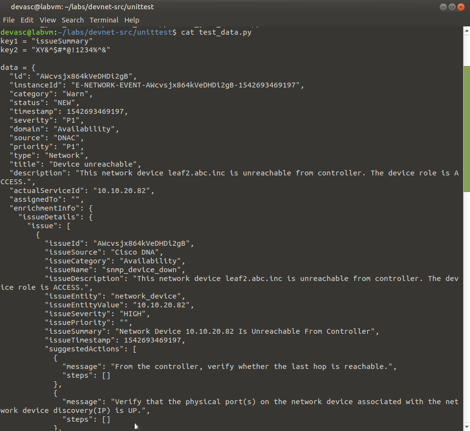
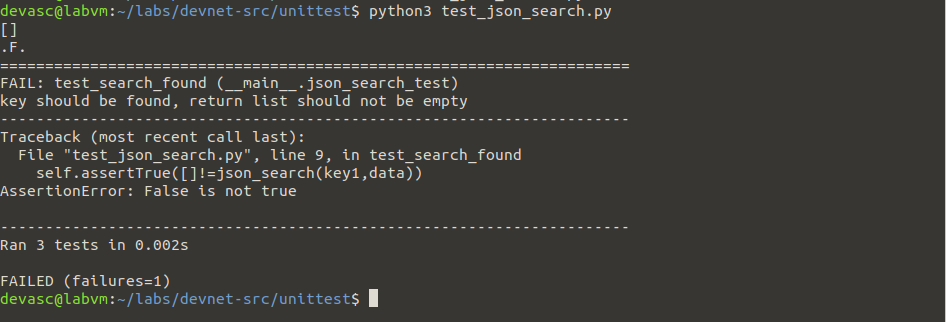
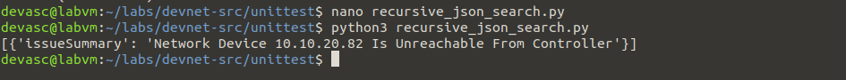
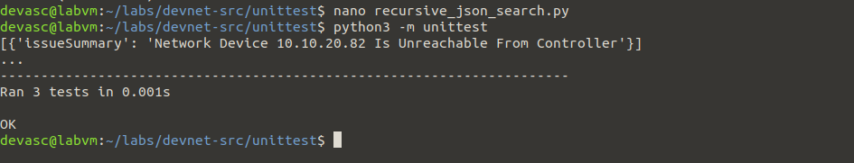

# U1 – Lab 3.5.7: Create a Python Unit Test

**In één zin:** een functie testen met Python's `unittest`, twee bugs vinden via falende tests, en beide oplossen.

## Wat de functie doet

`json_search(key, input_object)` doorzoekt een geneste JSON-structuur (dicts in lists in dicts, zoals een echte API-response) en geeft alle key/value-paren terug die matchen met de gezochte key.

## De drie tests

- `test_search_found` — een bestaande key (`issueSummary`) moet een niet-lege lijst opleveren.
- `test_search_not_found` — een niet-bestaande key moet een lege lijst opleveren.
- `test_is_a_list` — het resultaat moet altijd van het type `list` zijn.

## Bug 1: lokale reset

Eerste versie gaf altijd `[]` terug:

`ret_val=[]` stond **binnen** de functie, dus elke recursieve aanroep gooide de al gevonden resultaten weg. Fix: `ret_val=[]` buiten de functie zetten.

## Bug 2: globale variabele

Na de eerste fix faalde een andere test:

`ret_val` was nu een **globale** variabele — die bleef data onthouden tussen twéé verschillende testaanroepen door. Fix: de zoeklogica in een binnenfunctie (`inner_function`) stoppen, zodat `ret_val` bij elke aanroep van `json_search()` opnieuw begint.

## Mogelijke vragen

**Waarom testen met `unittest` in plaats van gewoon `print()` uitproberen?**
Een test blijft bestaan en kan automatisch herhaald worden. Een `print()`-controle doe je één keer met je ogen; een test draait elke keer opnieuw en meldt zelf of er iets brak.

**Wat betekent een punt (`.`) en een `F` in de output?**
Elke test die slaagt drukt een punt af, elke gefaalde test een `F`. Zo zie je in één regel hoeveel van je tests slaagden.

**Waarom een globale variabele vermijden?**
Een globale variabele onthoudt haar waarde tussen aanroepen. Dat lijkt onschuldig tot je de functie twee keer na elkaar met andere input aanroept — dan lekt het resultaat van de eerste aanroep in de tweede.

**Wat doet `if __name__ == '__main__':`?**
Zorgt dat `unittest.main()` alleen draait als je het bestand direct uitvoert, niet als een ander script dit bestand importeert.

## Wat ik ondervond

<!-- Eén of twee eigen zinnen over hoe je de tweede bug herkende aan ..F. -->
