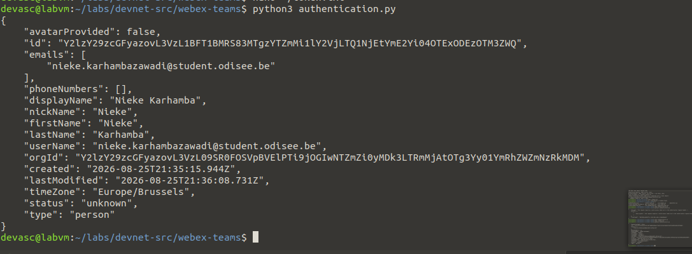
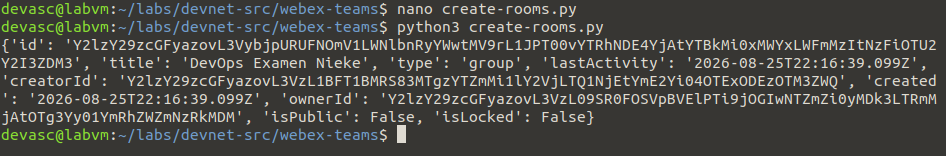
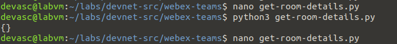
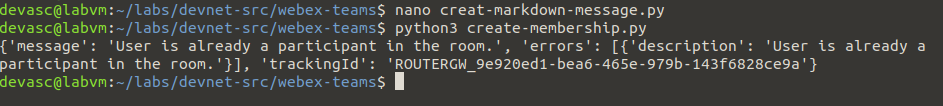
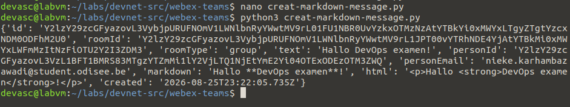

# W1 – Lab 8.6.7: Construct a Python Script to Manage Webex Teams

**In één zin:** met de Webex REST-API en een personal access token een room aanmaken, iemand toevoegen, en een bericht sturen — allemaal via losse Python-scripts.

## De keten van scripts

| Script | Doet |
|---|---|
| `authentication.py` | test of het token werkt (GET `/people/me`) |
| `list-people.py` | zoekt een gebruiker op e-mail |
| `create-rooms.py` | maakt een nieuwe room (POST `/rooms`) |
| `get-room-details.py` | haalt meeting-link en SIP-adres van de room op |
| `create-membership.py` | voegt iemand toe aan de room |
| `creat-markdown-message.py` | stuurt een Markdown-bericht in de room |

## Authenticatie

Elke aanroep gebruikt dezelfde header: `Authorization: Bearer <token>`. Dat token is 12 uur geldig — na afloop moet je een nieuw token halen en in elk script vervangen.

## Room aanmaken en beheren

## Mogelijke vragen

**Waarom een apart script per actie in plaats van één groot script?**
Elke actie is een aparte API-aanroep met haar eigen endpoint en parameters. Apart houden maakt elk stuk makkelijker te testen en te hergebruiken.

**Wat is het verschil tussen een GET- en een POST-aanroep hier?**
GET haalt iets op (mensen zoeken, roomdetails). POST maakt iets aan (een room, een membership, een bericht).

**Waarom staat het token letterlijk in de code in plaats van in een omgevingsvariabele?**
Voor een lab is dat aanvaardbaar; in een echt project hoort een token nooit in de broncode maar in een `.env`-bestand of secrets-manager, juist omdat wie het token heeft, toegang heeft tot je account.

**Wat is een "room" in Webex-termen?**
Een verzamelplek voor berichten tussen twee of meer mensen — in de gebruikersinterface "space" genoemd.

## Wat ik ondervond

<!-- Eén of twee eigen zinnen, bijvoorbeeld over het moment dat je het bericht in de Webex-app zag verschijnen. -->
